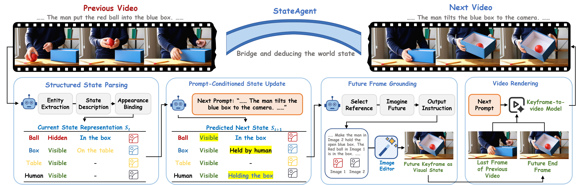

<h2 align="center">
  <a href="https://arxiv.org/abs/">
    Do Video Generators Track the World Across Segments? A Benchmark and Method for World-State Reasoning in Video Continuation
  </a>
</h2>

Video generators build long videos by composing shorter parts, either by generating segments one after another or by autoregressively extending chunks. Each new part usually depends on memories of historical observations, such as recent frames, selected key frames, memory banks, or cached features. These memories preserve visible evidence from the past, but current generators do not reliably turn such evidence into a world-state interface: what holds in the video world after previous actions and how it should change under the next prompt. A past frame remains valid history, but it may not describe the state needed by the next segment; some states must instead be inferred from occluded or implicit changes rather than copied from a directly observed frame. This creates a simple but overlooked question for video continuation: given a previous video, its prompt, and a new prompt, can a model generate a continuation that reflects the state determined by both the historical video and the new prompt? To answer this question, we introduce StateBench, a benchmark that targets this gap by testing continuations over three state categories: past-visible states, occluded-process states, and complex-transition states. We further propose StateAgent, which explicitly maintains an entity-state representation, updates it under the new prompt, grounds the predicted post-action state as a future end frame, and renders the next video. Experiments show that our method improves controlled video continuation by raising the all-case state score (SCS-All) from 45.2 to 69.3, and also benefits story generation at the one-minute scale.


<p align="center">
    
</p>

## 🚀 Environment Set Up

Clone this repository and install packages.

```bash
git clone https://github.com/AMAP-ML/StateAgent.git
cd StateAgent
conda create -n stateagent python=3.10.16
pip install -r requirements.txt
```

## 📊 Download Data

The task data should be downloaded to statebench/data.

## 🔑 Configuration

Set your DashScope API key:

```bash
export DASHSCOPE_API_KEY=sk-your-key-here
```

Copy `.env.example` to `.env` and modify model settings as needed.

StateAgent uses Alibaba Cloud DashScope API:

| Component | Model             | Role                               |
| --------- | ----------------- | ---------------------------------- |
| VLM       | Qwen3.5-Plus      | State reasoning, entity extraction |
| T2V       | Wan2.2-T2V-Plus   | Shot 1 text-to-video               |
| KF2V      | Wan2.2-KF2V-Flash | Shot 2+ keyframe-to-video          |
| Image     | Wan2.7-Image      | Reference frame generation         |

## 🏃 Quick Start

Run StateAgent on a single StateBench task:

```bash
python scripts/run_stateagent.py apple_into_drawer
```

Run StateAgent on multiple tasks:

```bash
python scripts/run_stateagent.py apple_into_drawer put_ball_on_table
```

Run StateAgent on all 200 StateBench tasks:

```bash
python scripts/run_stateagent.py --all
```

## 📊 StateBench

StateBench is a benchmark with **200 cross-segment continuation tasks** across 3 difficulty levels. [dataset](https://huggingface.co/datasets/moore12138/StateBench)

### Difficulty Levels

| Level                  | Count | Description                                                                     |
| ---------------------- | ----- | ------------------------------------------------------------------------------- |
| `past_visible`       | 85    | The target object was visible in a prior frame — tests temporal memory         |
| `occluded_process`   | 65    | The state change occurs while the object is occluded — tests process reasoning |
| `complex_transition` | 50    | Multiple state transitions or conflicting cues — tests compositional reasoning |

Each task in `statebench/metadata/statebench.json` contains:

- `id` — descriptive task identifier (e.g. `apple_into_drawer`)
- `difficulty` — `past_visible` | `occluded_process` | `complex_transition`
- `target_object` — primary entity to track
- `shots` — list of shot definitions with prompts
- `expected_state` — ground-truth state after the continuation
- `checklist` — evaluation checklist items
- `reference_frames` — 3 reference frames (history start, action, pre-reveal)

## 📈 Evaluation

```bash
python statebench/eval/evaluate.py --video-dir outputs/stateagent
```

- **SES** (State Equivalence Score) — whether the reveal achieves the expected state
- **SCS** (State Correctness Score) — correctness of tracked entity states (conditioned on SES=1)
- **HR** (Hallucination Rate) — fraction of hallucinated entities in the output

## 👍 Acknowledgement

- [**StoryMem**](https://github.com/PRIS-CV/StoryMem): Huge thanks for their elegant codebase 🤩!
- [**Wan2.2**](https://github.com/Wan-Video/Wan2.2): Huge thanks for their excellent video generation models 🤩!

## ✏️ Citation

```
@article{stateagent2026,
  title={StateAgent: Cross-Segment Video Continuation via State Tracking},
  year={2026}
}
```
